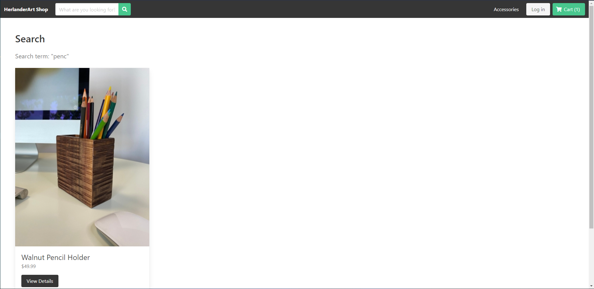

# django-vue-ecommerce
> Full-Stack E-Commerce site. Django, Django-REST-Framework, Djores, and Django CORES for the back-end. Vue.js, Axios, and Bulma for the front-end

## Table of Contents
* [Technologies Used](#technologies-used)
* [Features](#features)
* [Screenshots](#screenshots)
* [Project Status](#project-status)
* [Room for Improvement](#room-for-improvement)
* [Contact](#contact)

## Technologies Used
- Django - version 3.1.7
- Django-REST-Framework - version 3.13.1
- Djoser - version 2.1.0
- Django-CORS-Headers - version 3.11.0
- Pillow - version 9.0.1
- Vue - version 3.0.0
- Axios - version 0.25.0
- Bulma - version 0.9.3
- Bulma-Toast - version 2.4.1

## Features
List the ready features here:
- Latest Page Products
- Product Page Information
- Cart System
- Login in System w/ Token authentication
- Search Functionality
- Administrator Page
- My Account/Order History
- REST API
- Responsive Design (mobile/tablet/desktop)

## Screenshots

## Project Status
Project is: _in progress_

## Room for Improvement

Room for improvement:
- add more comments
- clean up loose code

To do:
- landing page
- contact page
- portfolio page

## Contact
Created by [@SergioHPassos](https://www.linkedin.com/in/sergio-passos-809aa114a/) - feel free to contact me!
